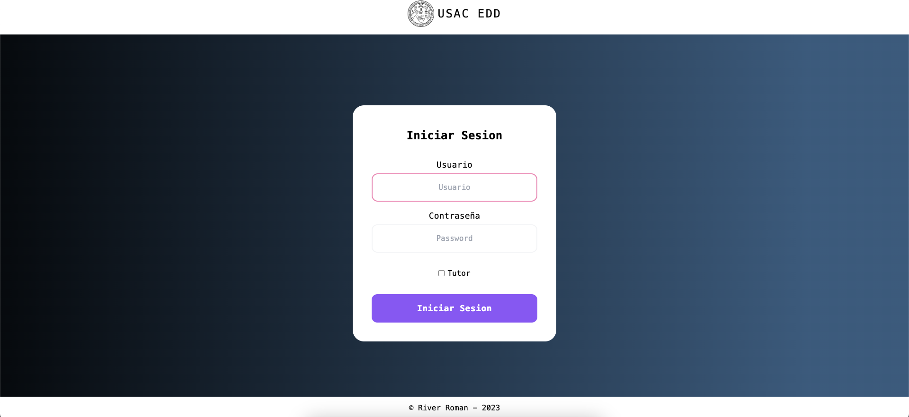
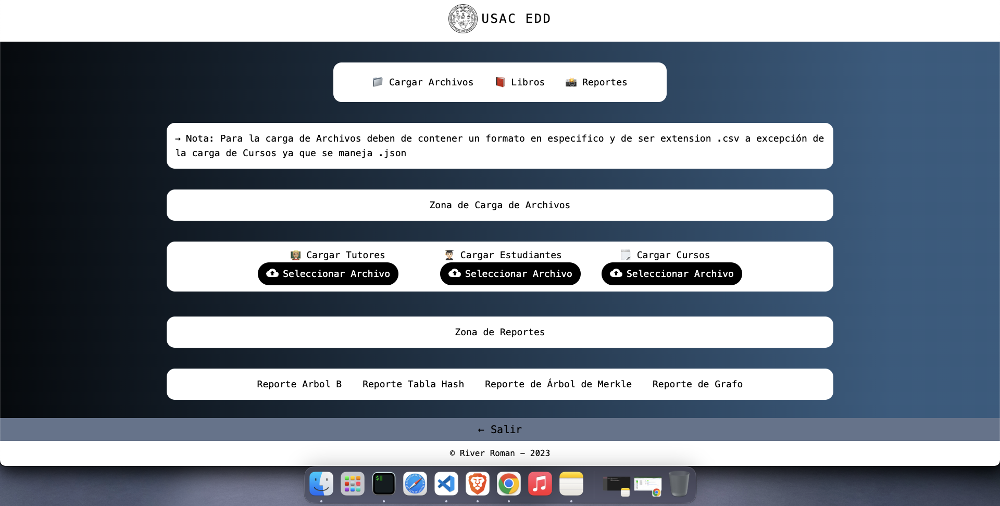
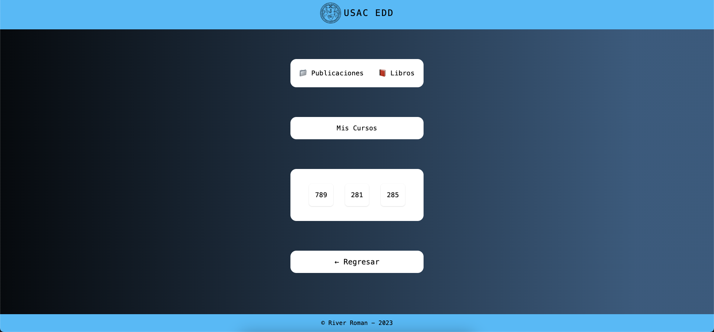
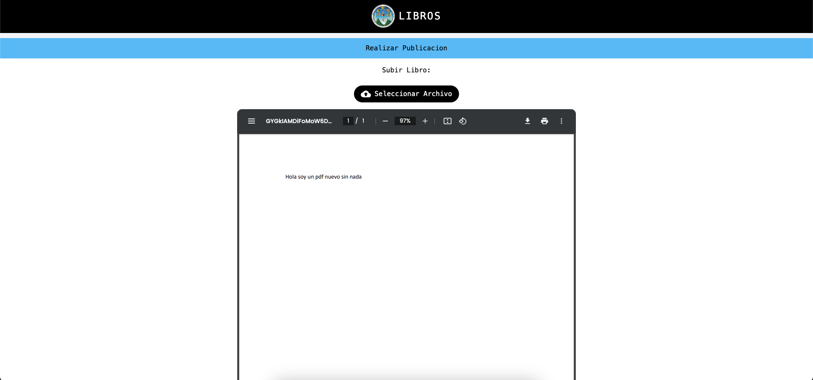
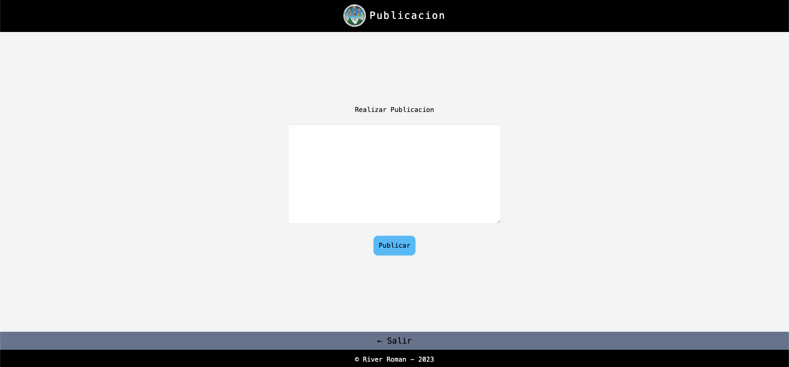
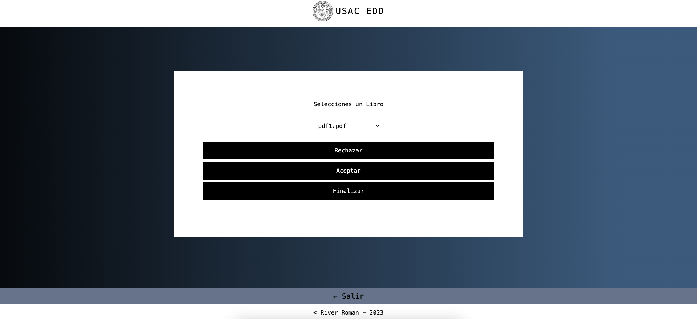

## ESTRUCTURA DE DATOS VD2S2023 PY 202100096 - FASE 2

## UNIVERSIDAD DE SAN CARLOS DE GUATEMALA

|**CARNET**  |      **NOMBRE COMPLETO**          |  
|----------|:-----------------------------------:|
|202100096 |  RIVER ANDERSON - ISMALEJ ROMAN     |    
| AUXILIAR |            CRISTIAN SUY             |   
| SECCION  |                "A"                  |  

#### 📌 MANUAL USUARIO

### **Objetivos Generales**
* Aplicar los conocimientos del curso Estructuras de Datos en el desarrollo de las diferentes estructuras de datos y los diferentes algoritmos de manipulación de la información en ellas.

---
>### **Login**
* Al iniciar el programa, contaremos con un login para iniciar sesión como Administrador, Estudiante o como Tutor.

    

---
>### **Menu Administrador**
* Al iniciar sesión como administrador tendremos diferentes acciones por hacer cargar archivos de entradas, generar reportes gráficos y tener control sobre aceptar o rechazar Libros.

    

---
#### **Cargar Archivos**

* Tendremos la opcion de cargar nuestros archivos para poder realizar diferentes solicitudes.

    

---
* Nota: Para cargar los archivos de entrada se debe colocar el nombre del archivo con extensión .csv exceptuando la carga de cursos ya que se manejo con .json .

---

### **Reportes**

* Luego de cargar los tutores, contaremos con una opción para poder generar nuestros Reportes Gráficos.

    

---

### **Estudiantes**

* En el Área de Estudiantes vamos a poder visualizar nuestros cursos asignados ademas de poder ver si algun tutor ha realizado una publicacion o ha posteado algun libro.

    

>### **Tutores**
* En el Área de Tutor contaremos con la opcion de poder publicar un libro, este libro debe ser aceptado por el Administrador.

**Publicacion de Libros**

    

---
**Realizar Publicaciones**

* En el apartado de Publicaciones podemos realizar un post para que los estudiantes logren visualizar alguna informacion importante.

    

---
>#### **Control de Libros**
* En el apartado del Administrador podremos decidir que libros aceptar y rechazar luego el estudiante podra visualizar los libros aceptados.

    

---

#### 📌 MANUAL TECNICO

>### **Arbol B**

>##### **Para el manejo de los Tutores se manejo la estructura de Arbol tipo B.**
* Donde los parametros mas importantes eran el carnet, nombre, curso y password

        func (a *ArbolB) Insertar(carnet int, nombre string, curso string, password string) {
        tutor := &Tutores{Carnet: carnet, Nombre: nombre, Curso: curso, Password: password}
        nuevoNodo := &NodoB{Valor: tutor}
        if a.Raiz == nil {
            a.Raiz = &RamaB{Primero: nil, Hoja: true, Contador: 0}
            a.Raiz.Insertar(nuevoNodo)
        } else {
            obj := a.insertar_rama(nuevoNodo, a.Raiz)
            if obj != nil {
                a.Raiz = &RamaB{Primero: nil, Hoja: true, Contador: 0}
                a.Raiz.Insertar(obj)
                a.Raiz.Hoja = false
            }
        }
    }

---
>### **Arbol Merkle**

> **Para el manejo de Libros se implemento las estructa de Arbol Merkle donde agregamos bloques por cada libro que es rechazado o aceptado.**

    func (a *ArbolMerkle) AgregarBloque(estado string, nombreLibro string, carnet int) {
        nuevoRegistro := &InformacionBloque{Fecha: fechaActual(), Accion: estado, Nombre: nombreLibro, Tutor: carnet}
        nuevoBloque := &NodoBloqueDatos{Valor: nuevoRegistro}
        if a.BloqueDeDatos == nil {
            a.BloqueDeDatos = nuevoBloque
            a.CantidadBloques++
        } else {
            aux := a.BloqueDeDatos
            for aux.Siguiente != nil {
                aux = aux.Siguiente
            }
            nuevoBloque.Anterior = aux
            aux.Siguiente = nuevoBloque
            a.CantidadBloques++
        }
    }

---
>### **Grafo**

> ##### **Para el manejo de los cursos se implemento la estructura de un Grafo, donde sea realiza la insercion de Columnas y Filas para agregar nodos .**

        func (g *Grafo) insertarColumna(curso string, post string) {
        nuevoNodo := &NodoListaAdyacencia{Valor: post}
        if g.Principal != nil && curso == g.Principal.Valor {
            g.insertarFila(post)
            aux := g.Principal
            for aux.Siguiente != nil {
                aux = aux.Siguiente
            }
            aux.Siguiente = nuevoNodo
        } else {
            g.insertarFila(curso)
            aux := g.Principal
            for aux != nil {
                if aux.Valor == curso {
                    break
                }
                aux = aux.Abajo
            }
            if aux != nil {
                for aux.Siguiente != nil {
                    aux = aux.Siguiente
                }
                aux.Siguiente = nuevoNodo
                }
            }
        }

---
>### **Tabla Hash**

> ##### **Para el manejo de los Alumnos se implemnto la estructura de una Tabla Hash, resaltando como suma importancia la capacidad y utilizacion de la Tabla.**

            func (t *TablasHash) Insertar(carnet int, nombre string, password string, cursos []string) {
                indice := t.calculoIndice(carnet)
                nuevoNodo := &NodoHash{Llave: indice, Persona: &Persona{Carnet: carnet, Nombre: nombre, Password: password, Curso1: curso1, Curso2: curso2, Curso3: curso3}}
                if indice < t.Capacidad {
                    if _, existe := t.Tabla[indice]; !existe {
                        t.Tabla[indice] = *nuevoNodo
                        t.Utilizacion += 1
                        t.capacidadTabla()
                    } else {
                        contador := 1
                        indice = t.reCalculoIndice(carnet, contador)
                        for {
                            if _, existe := t.Tabla[indice]; existe {
                                contador++
                                indice = t.reCalculoIndice(carnet, contador)
                            } else {
                                nuevoNodo.Llave = indice
                                t.Tabla[indice] = *nuevoNodo
                                t.Utilizacion += 1
                                t.capacidadTabla()
                                break
                            }
                        }
                    }
                }
            }

---